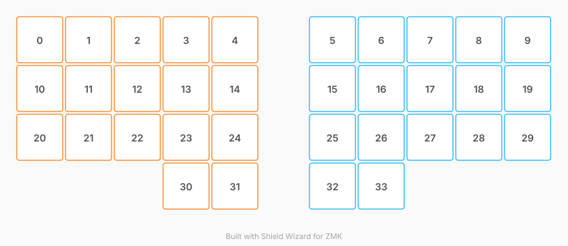

# ZMK Configuration for leighboard26

*Generated by Shield Wizard for ZMK*



Download compiled firmware from the Actions tab. <https://zmk.dev/docs/user-setup#installing-the-firmware>

Edit your keymap <https://zmk.dev/docs/keymaps>.
User keymap is located at [`config/leighboard26.keymap`](config/leighboard26.keymap).

-----

<details>
<summary>
Shield Wizard Debug Information
</summary>

In case of broken configuration, here is the Shield Wizard internal data used to generate this configuration:

Commit: 7ee29dba13bb6e3b8a7524c1aa57934684b06785

```json
{"name":"leighboard26","shield":"leighboard26","dongle":true,"modules":[],"layout":[{"id":"01KYCE6PHTTWNAP7ATBEVDFER7","part":0,"row":0,"col":1,"w":1,"h":1,"x":1,"y":0,"r":0,"rx":0,"ry":0},{"id":"01KYCE6PHTRPFS4EVP984M9X60","part":0,"row":0,"col":2,"w":1,"h":1,"x":2,"y":0,"r":0,"rx":0,"ry":0},{"id":"01KYCE6PHTVS3QBB72QJVZEN8V","part":0,"row":0,"col":3,"w":1,"h":1,"x":3,"y":0,"r":0,"rx":0,"ry":0},{"id":"01KYCE6PHTB39BF2AAYX71DD9N","part":0,"row":0,"col":4,"w":1,"h":1,"x":4,"y":0,"r":0,"rx":0,"ry":0},{"id":"01KYCE6PHT8T5WCRGS6MZQPXT6","part":0,"row":0,"col":5,"w":1,"h":1,"x":5,"y":0,"r":0,"rx":0,"ry":0},{"id":"01KYCE6PHTQZ7Q4711C4K3D09J","part":1,"row":0,"col":6,"w":1,"h":1,"x":7,"y":0,"r":0,"rx":0,"ry":0},{"id":"01KYCE6PHT9BP85NV2SK2J8XMG","part":1,"row":0,"col":7,"w":1,"h":1,"x":8,"y":0,"r":0,"rx":0,"ry":0},{"id":"01KYCE6PHT50FKKGEKMDCBQKBV","part":1,"row":0,"col":8,"w":1,"h":1,"x":9,"y":0,"r":0,"rx":0,"ry":0},{"id":"01KYCE6PHT5031RGCEZ4XZPJV8","part":1,"row":0,"col":9,"w":1,"h":1,"x":10,"y":0,"r":0,"rx":0,"ry":0},{"id":"01KYCE6PHT85TPCHGEJZQNXE7S","part":1,"row":0,"col":10,"w":1,"h":1,"x":11,"y":0,"r":0,"rx":0,"ry":0},{"id":"01KYCE6PHT0Z864P4S7Y609DPQ","part":0,"row":1,"col":1,"w":1,"h":1,"x":1,"y":1,"r":0,"rx":0,"ry":0},{"id":"01KYCE6PHTBYXPHWJ4WVMFTT6Z","part":0,"row":1,"col":2,"w":1,"h":1,"x":2,"y":1,"r":0,"rx":0,"ry":0},{"id":"01KYCE6PHV791CV97H43V943C5","part":0,"row":1,"col":3,"w":1,"h":1,"x":3,"y":1,"r":0,"rx":0,"ry":0},{"id":"01KYCE6PHV50ZE7WGPYTQYZRTA","part":0,"row":1,"col":4,"w":1,"h":1,"x":4,"y":1,"r":0,"rx":0,"ry":0},{"id":"01KYCE6PHVE0K41GZ546K1B14Q","part":0,"row":1,"col":5,"w":1,"h":1,"x":5,"y":1,"r":0,"rx":0,"ry":0},{"id":"01KYCE6PHVRKVY737AFXFFE26T","part":1,"row":1,"col":6,"w":1,"h":1,"x":7,"y":1,"r":0,"rx":0,"ry":0},{"id":"01KYCE6PHVZ4SX4MPWMB0DMPEZ","part":1,"row":1,"col":7,"w":1,"h":1,"x":8,"y":1,"r":0,"rx":0,"ry":0},{"id":"01KYCE6PHVPHJ19900WXQYMDBC","part":1,"row":1,"col":8,"w":1,"h":1,"x":9,"y":1,"r":0,"rx":0,"ry":0},{"id":"01KYCE6PHV4M2Q6K0YSNBN8Z3Q","part":1,"row":1,"col":9,"w":1,"h":1,"x":10,"y":1,"r":0,"rx":0,"ry":0},{"id":"01KYCE6PHVGKR2DRD7F93E13CX","part":1,"row":1,"col":10,"w":1,"h":1,"x":11,"y":1,"r":0,"rx":0,"ry":0},{"id":"01KYCE6PHVM3ARGXRSBJVXMRHR","part":0,"row":2,"col":1,"w":1,"h":1,"x":1,"y":2,"r":0,"rx":0,"ry":0},{"id":"01KYCE6PHV5722DDES8FSQ8V5Y","part":0,"row":2,"col":2,"w":1,"h":1,"x":2,"y":2,"r":0,"rx":0,"ry":0},{"id":"01KYCE6PHVQ9KTJ6A7VGE3PNMM","part":0,"row":2,"col":3,"w":1,"h":1,"x":3,"y":2,"r":0,"rx":0,"ry":0},{"id":"01KYCE6PHVXCR10V1GXQ30570F","part":0,"row":2,"col":4,"w":1,"h":1,"x":4,"y":2,"r":0,"rx":0,"ry":0},{"id":"01KYCE6PHV92M5WTSD2RJP083V","part":0,"row":2,"col":5,"w":1,"h":1,"x":5,"y":2,"r":0,"rx":0,"ry":0},{"id":"01KYCE6PHVWP09572N5QYSFTSH","part":1,"row":2,"col":6,"w":1,"h":1,"x":7,"y":2,"r":0,"rx":0,"ry":0},{"id":"01KYCE6PHV0268THQ8MMHC01JQ","part":1,"row":2,"col":7,"w":1,"h":1,"x":8,"y":2,"r":0,"rx":0,"ry":0},{"id":"01KYCE6PHVBT7VKPR1Q8TF14WY","part":1,"row":2,"col":8,"w":1,"h":1,"x":9,"y":2,"r":0,"rx":0,"ry":0},{"id":"01KYCE6PHV4J5H1ETGGTE490A7","part":1,"row":2,"col":9,"w":1,"h":1,"x":10,"y":2,"r":0,"rx":0,"ry":0},{"id":"01KYCE6PHV5Q1NV3CMPE3TBSGS","part":1,"row":2,"col":10,"w":1,"h":1,"x":11,"y":2,"r":0,"rx":0,"ry":0},{"id":"01KYCE6PHV0D2KYG5BY750DWBB","part":0,"row":3,"col":4,"w":1,"h":1,"x":4,"y":3,"r":0,"rx":0,"ry":0},{"id":"01KYCE6PHVCZTE2WW2AWEVTQ5W","part":0,"row":3,"col":5,"w":1,"h":1,"x":5,"y":3,"r":0,"rx":0,"ry":0},{"id":"01KYCE6PHV2SZ8JN3QAKD141EB","part":1,"row":3,"col":6,"w":1,"h":1,"x":7,"y":3,"r":0,"rx":0,"ry":0},{"id":"01KYCE6PHVFTDM8Y0RAW79TBQ8","part":1,"row":3,"col":7,"w":1,"h":1,"x":8,"y":3,"r":0,"rx":0,"ry":0}],"parts":[{"name":"left","controller":"nice_nano_v2","pins":{"d1":{"usage":"kscan","kscan":"01KYCDXX5YYQQ6KSZPJ3H9AE6P","role":"input"},"d0":{"usage":"kscan","kscan":"01KYCDXX5YYQQ6KSZPJ3H9AE6P","role":"input"},"d2":{"usage":"kscan","kscan":"01KYCDXX5YYQQ6KSZPJ3H9AE6P","role":"input"},"d3":{"usage":"kscan","kscan":"01KYCDXX5YYQQ6KSZPJ3H9AE6P","role":"input"},"d4":{"usage":"kscan","kscan":"01KYCDXX5YYQQ6KSZPJ3H9AE6P","role":"input"},"d5":{"usage":"kscan","kscan":"01KYCDXX5YYQQ6KSZPJ3H9AE6P","role":"input"},"d6":{"usage":"kscan","kscan":"01KYCDXX5YYQQ6KSZPJ3H9AE6P","role":"input"},"d7":{"usage":"kscan","kscan":"01KYCDXX5YYQQ6KSZPJ3H9AE6P","role":"input"},"d8":{"usage":"kscan","kscan":"01KYCDXX5YYQQ6KSZPJ3H9AE6P","role":"input"},"d9":{"usage":"kscan","kscan":"01KYCDXX5YYQQ6KSZPJ3H9AE6P","role":"input"},"d10":{"usage":"kscan","kscan":"01KYCDXX5YYQQ6KSZPJ3H9AE6P","role":"input"},"d16":{"usage":"kscan","kscan":"01KYCDXX5YYQQ6KSZPJ3H9AE6P","role":"input"},"d14":{"usage":"kscan","kscan":"01KYCDXX5YYQQ6KSZPJ3H9AE6P","role":"input"},"d15":{"usage":"kscan","kscan":"01KYCDXX5YYQQ6KSZPJ3H9AE6P","role":"input"},"d18":{"usage":"kscan","kscan":"01KYCDXX5YYQQ6KSZPJ3H9AE6P","role":"input"},"d19":{"usage":"kscan","kscan":"01KYCDXX5YYQQ6KSZPJ3H9AE6P","role":"input"},"d20":{"usage":"kscan","kscan":"01KYCDXX5YYQQ6KSZPJ3H9AE6P","role":"input"}},"kscans":[{"kind":"direct","id":"01KYCDXX5YYQQ6KSZPJ3H9AE6P","mode":"gnd"}],"keys":{"01KYCE6PHTTWNAP7ATBEVDFER7":{"input":"d1"},"01KYCE6PHTRPFS4EVP984M9X60":{"input":"d0"},"01KYCE6PHTVS3QBB72QJVZEN8V":{"input":"d2"},"01KYCE6PHTB39BF2AAYX71DD9N":{"input":"d3"},"01KYCE6PHT8T5WCRGS6MZQPXT6":{"input":"d4"},"01KYCE6PHT0Z864P4S7Y609DPQ":{"input":"d5"},"01KYCE6PHTBYXPHWJ4WVMFTT6Z":{"input":"d6"},"01KYCE6PHV791CV97H43V943C5":{"input":"d7"},"01KYCE6PHV50ZE7WGPYTQYZRTA":{"input":"d8"},"01KYCE6PHVE0K41GZ546K1B14Q":{"input":"d9"},"01KYCE6PHVM3ARGXRSBJVXMRHR":{"input":"d10"},"01KYCE6PHV5722DDES8FSQ8V5Y":{"input":"d16"},"01KYCE6PHVQ9KTJ6A7VGE3PNMM":{"input":"d14"},"01KYCE6PHVXCR10V1GXQ30570F":{"input":"d15"},"01KYCE6PHV92M5WTSD2RJP083V":{"input":"d18"},"01KYCE6PHVCZTE2WW2AWEVTQ5W":{"input":"d19"},"01KYCE6PHV0D2KYG5BY750DWBB":{"input":"d20"}},"encoders":[],"buses":{}},{"name":"right","controller":"nice_nano_v2","pins":{"d1":{"usage":"kscan","kscan":"01KYCDXPHZ98ZCTBBDM2NEZ1WA","role":"input"},"d0":{"usage":"kscan","kscan":"01KYCDXPHZ98ZCTBBDM2NEZ1WA","role":"input"},"d2":{"usage":"kscan","kscan":"01KYCDXPHZ98ZCTBBDM2NEZ1WA","role":"input"},"d3":{"usage":"kscan","kscan":"01KYCDXPHZ98ZCTBBDM2NEZ1WA","role":"input"},"d4":{"usage":"kscan","kscan":"01KYCDXPHZ98ZCTBBDM2NEZ1WA","role":"input"},"d5":{"usage":"kscan","kscan":"01KYCDXPHZ98ZCTBBDM2NEZ1WA","role":"input"},"d6":{"usage":"kscan","kscan":"01KYCDXPHZ98ZCTBBDM2NEZ1WA","role":"input"},"d7":{"usage":"kscan","kscan":"01KYCDXPHZ98ZCTBBDM2NEZ1WA","role":"input"},"d8":{"usage":"kscan","kscan":"01KYCDXPHZ98ZCTBBDM2NEZ1WA","role":"input"},"d9":{"usage":"kscan","kscan":"01KYCDXPHZ98ZCTBBDM2NEZ1WA","role":"input"},"d10":{"usage":"kscan","kscan":"01KYCDXPHZ98ZCTBBDM2NEZ1WA","role":"input"},"d16":{"usage":"kscan","kscan":"01KYCDXPHZ98ZCTBBDM2NEZ1WA","role":"input"},"d14":{"usage":"kscan","kscan":"01KYCDXPHZ98ZCTBBDM2NEZ1WA","role":"input"},"d15":{"usage":"kscan","kscan":"01KYCDXPHZ98ZCTBBDM2NEZ1WA","role":"input"},"d18":{"usage":"kscan","kscan":"01KYCDXPHZ98ZCTBBDM2NEZ1WA","role":"input"},"d19":{"usage":"kscan","kscan":"01KYCDXPHZ98ZCTBBDM2NEZ1WA","role":"input"},"d20":{"usage":"kscan","kscan":"01KYCDXPHZ98ZCTBBDM2NEZ1WA","role":"input"}},"kscans":[{"kind":"direct","id":"01KYCDXPHZ98ZCTBBDM2NEZ1WA","mode":"gnd"}],"keys":{"01KYCE6PHTQZ7Q4711C4K3D09J":{"input":"d1"},"01KYCE6PHT9BP85NV2SK2J8XMG":{"input":"d0"},"01KYCE6PHT50FKKGEKMDCBQKBV":{"input":"d2"},"01KYCE6PHT5031RGCEZ4XZPJV8":{"input":"d3"},"01KYCE6PHT85TPCHGEJZQNXE7S":{"input":"d4"},"01KYCE6PHVGKR2DRD7F93E13CX":{"input":"d5"},"01KYCE6PHV4M2Q6K0YSNBN8Z3Q":{"input":"d6"},"01KYCE6PHVPHJ19900WXQYMDBC":{"input":"d7"},"01KYCE6PHVZ4SX4MPWMB0DMPEZ":{"input":"d8"},"01KYCE6PHVRKVY737AFXFFE26T":{"input":"d9"},"01KYCE6PHVWP09572N5QYSFTSH":{"input":"d10"},"01KYCE6PHV0268THQ8MMHC01JQ":{"input":"d16"},"01KYCE6PHVBT7VKPR1Q8TF14WY":{"input":"d14"},"01KYCE6PHV4J5H1ETGGTE490A7":{"input":"d15"},"01KYCE6PHV5Q1NV3CMPE3TBSGS":{"input":"d18"},"01KYCE6PHV2SZ8JN3QAKD141EB":{"input":"d19"},"01KYCE6PHVFTDM8Y0RAW79TBQ8":{"input":"d20"}},"encoders":[],"buses":{}}]}
```

</details>
